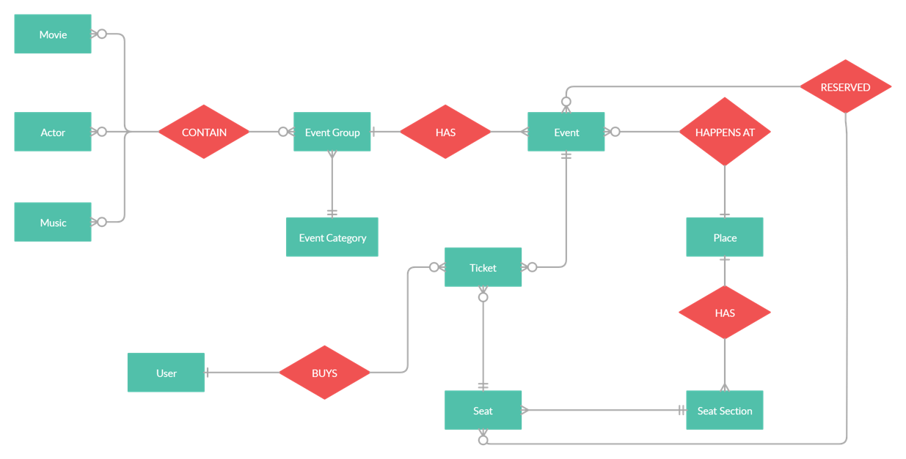
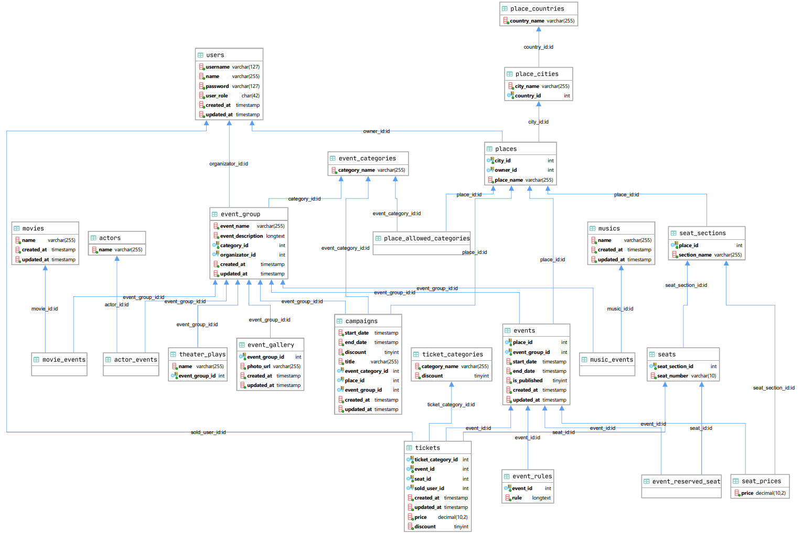

### CSE 414 Databases Project

SQL VERSION =  8.0.19 - MySQL Community Server - GPL

##### HOW TO INSTALL AND RUN USER INTERFACE

- Run the sql commands in "database.sql"
- Update mysql server credentials accordingly in "db.js"
- Run "npm install" to install dependencies
- Run "npm start" to start the user interface
- Go to http://localhost:3000/

##### DIAGRAMS

 

 
